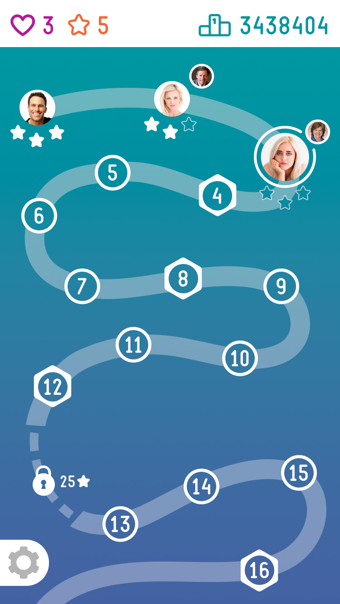
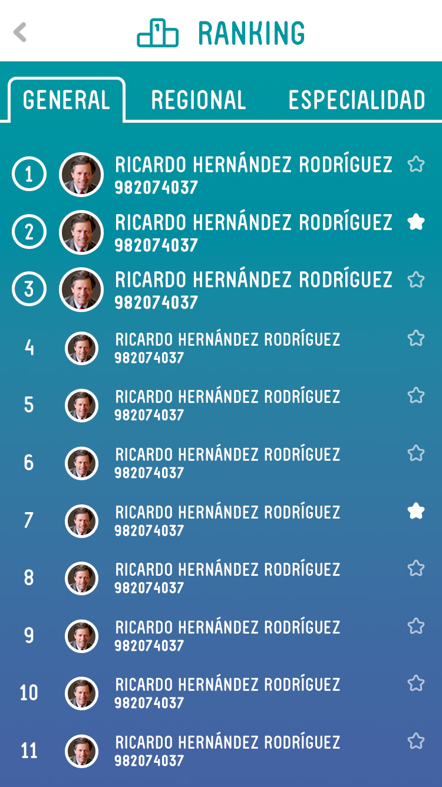
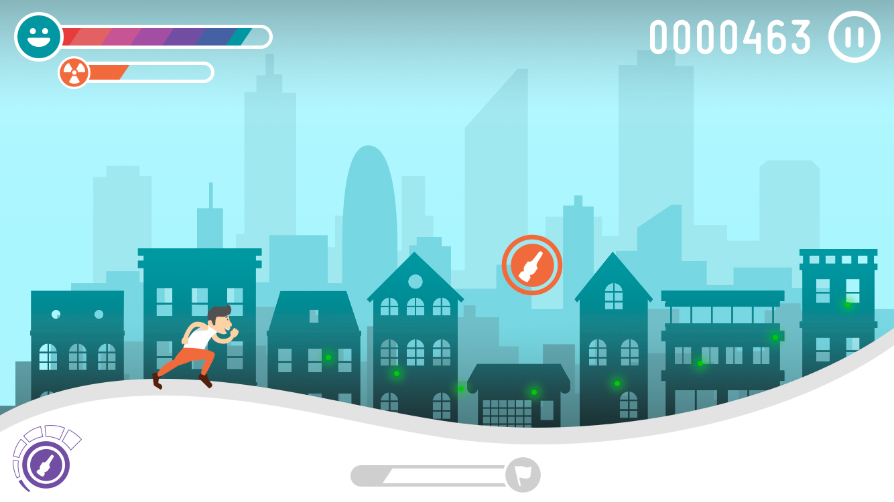
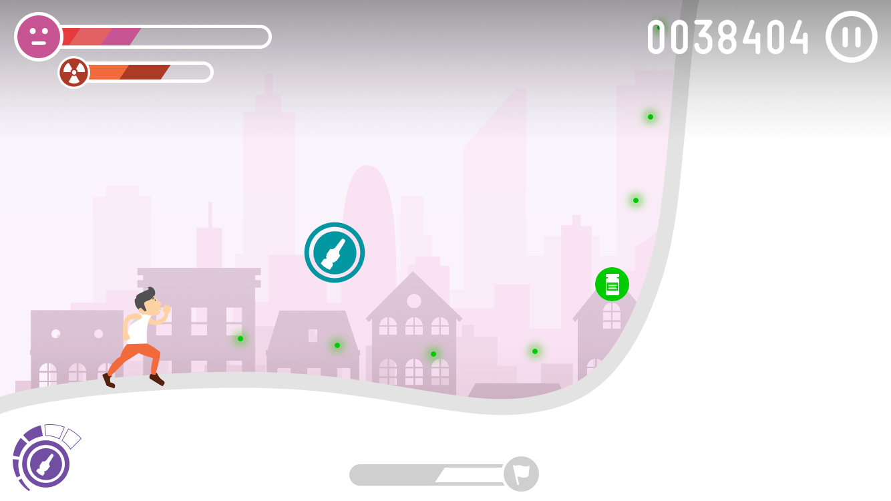

# Concepto: Pain Runner

Este concepto de juego unifica las tres experiencias del proyecto inicial (diagnósico, aplicación e impacto emocional) en una sola más compacta y simplificada.

La idea esencial es desplazarnos por la curva de dolor al estilo “infinite runner”.

# Mapa

Actúa como pantalla de inicio y como principal metáfora de evolución, mostrando nuestro progreso y el de nuestros principales competidores.

En la parte superior veremos las "vidas" que tenemos disponibles (que se recuperan con el transcurso del tiempo).

Este modelo de vidas con recuperación en el tiempo nos permitirá reforzar el efecto Zeigarnik que será uno de los potenciadores claves de la experiencia a largo plazo (junto con el prestigio social y el reto de evolución personal).

Dado que nuestra intención es sensibilizar al usuario sobre la relevancia del dolor irruptivo y su tratamiento, preferimos un modelo que llame su atención de forma sostenida en el tiempo frenta a una experiencia concentrada.

Cada vez que haya recuperado todas las vidas, me llegará una notificación push invitándome a continuar por lo que inventivaremos el modelo de multiples impactos a los largo del tiempo.

En el mapa podremos observar nuestro Score y los distintos "casos clínicos" que tenemos disponibles.

Los distintos casos clínicos estarán representados por caras de pacientes.

Los que no están disponibles están velados (aquellas fases a las que aun no he llegado) y los ya realizados presentan el estado de ánimo del paciente: en una evolución entre cara de dolor y de bienestar (segun el resultado obtenido).

Seleccionando cada una de las caras se mostrará un pequeño perfil (para darle un mayor factor humano) y podremos jugar a ese caso concreto.

La idea es que lo que nos encontremos en cada fase este relacionado con el perfil, teniendo que enfrentarnos a casos progresivamente más complejos con una curva de dificultad bien medida (en lo referente a gestión del dolor), pero que exploren varias dinámicas relacionadas con la descripción personal que se haga del caso.

Por ejemplo un ejecutivo con un ritmo de vida frenético puede implicar un caso en el que el tiempo es muy limitado y en eso reside la dificultad de su gestión del dolor (y no tanto en que tenga un número elevado de crisis de dolor irruptivo, por ejemplo).

Cada uno de los casos puedo haberlo superado con mayor o menor nivel de éxito. 

Para cada uno habrá una puntuación mínima requerida para obtener dos o tres estrellas, incentivando la re-jugabilidad de los niveles hasta conseguir hacerlos perfectos.

Bastará con terminar el nivel para obtener la primera estrella y poder pasar al siguiente, pero determinados puntos del recorrido solo podrán ser desbloqueados habiendo acumulado un Nº de estrellas determinado.

Medinte los botones de la parte superior derecha, también podremos acceder a los rankings (general, por perfil y geográficos) desde los que podremos seleccionar los usuarios "favoritos" que apareceran destacados en el mapa.

Ajustes nos permitir cambiar configuraciones del juego como el volumen y la cuenta asociada al mismo.

Esta cuenta será persistente entre dispositivos, pudiendo "autenticarme" en varios y llevarme el avance de uno a otro.

# La mecánica del juego
 
En el juego llevaremos a un corredor / patinador o similar (que en caso de querer hacerlo mas abstracto podría ser una esfera o algún tipo de objeto) que se desplaza rápidamente por la curva del dolor del paciente.
 
Cuando dicha curva desciende ganará velocidad y cuando asciende se irá frenando.
 
Pulsando sobre cualquier parte de la pantalla saltaremos, pudiendo emplear esta dinámica para alcanzar Power Ups, esquivar obstáculos e impulsarnos haciendo que las bajadas coincidan curvas descendentes.
 
Para evitar la frustración de que la repercusión de un error cometido al inicio tenga consecuencias a largo plazo y reducir al máximo la latencia entre el fallo y su consecuencia, el limite de tiempo se representará como un perseguidor virtual: Un derrumbamiento que nos persigue y que si no vamos suficientemente rápido (a causa de haber enfrentado demasiadas subidas de dolor) nos alcance y termine la partida perdiendo una vida.
 
Esta metáfora podría ser desde una avalancha, un río de lava, una nube de niebla o cualquier otra cosa que simbolice que el dolor ha hecho que no pudiéramos superar el día a día y aguantar el ritmo.

Un indicador a modo de "mapa de la fase" nos mostrará el punto del recorrido donde nos encontramos y la distancia que hemos conseguido acumular con respecto a nuestro perseguidor.

También se mostrarán otros dos indicadores (en la parte superior izquierda):

- Nivel de dolor (la altitud a la que me encuentro en este momento)
- Nivel de toxicidad (que irá disminuyendo conforme pasa el tiempo)

Ambos afectan de manera negativa a nuestra carrera:

- El nivel de dolor tendrá un efecto visual e intensificará la música saturando los colores y afectando a la visibilidad.
- El nivel de toxicidad aplicará otro filtro distinto, que afectará del mismo modo a nuestra capacidad para ver los elementos del escenario.

Aparte de no permitirnos ver bien, dispondremos al final de la fase de un bonus de puntos por:

- Terminar con un nivel bajo de toxicidad
- Terminar con un nivel de dolor bajo
- El tiempo sobrante
- La cantidad de producto sobrante (se cuenta más adelante)

Durante el transcurso de la fase nos encontraremos con distintos tipos de Power Ups:

- Incrementar la dosis de tratamiento base del dolor
- Decrementar la dosis de tratamiento base del dolor
- Instanyl 50 (Naranja)
- Instanyl 100 (Morado)
- Instanyl 200 (Azul verdoso)

Incrementar la dosis de tratamiento base del dolor hará que la pendiente del escenario se incline más hacia abajo (rotando unos grados) por lo que ganaremos velocidad y reduciremos el nivel de dolor (al bajar la altitud), sin embargo se incrementará el nivel de toxicidad.

Decrementar la dosis de tratamiento base del dolor tendrá el efecto inverso, haciendo que la pendiente se incremente, pero reduciendo progresivamente el nivel de toxicidad.

En cierta manera estos dos potenciadores del tratamiento base nos permiten regular la pendiente para encontrar un compromiso entre los dos valores, haciendo que según transcurra la fase evolucionando sea necesario coger algunos o dejarlos pasar.

La estructura de cada “fase” será fija (no aleatoria) en lo referente a la curva y la localización de los distintos elementos por lo que el usuario deberá aprender donde saltar y que conviene coger en cada momento.

Los potenciadores de Instanyl cargarán la barra de la parte inferior izquierda del interface acumulando producto según la cantidad correspondiente a cada uno de los 3 colores.

En determinados lugares nos encontraremos con subidas bruscas del nivel de dolor que no podremos saltar con facilidad ni superar (salvo que llevemos muchísima velocidad habiendo elevado mucho el tratamiento base y por lo tanto disparado el nivel de toxicidad). Para sortear estos obstáculos deberemos emplear el Instanyl que tengamos acumulado.

Pulsando sobre el botón de la zona izquierda y manteniéndolo pulsado veremos como dicho pico puntual se reduce progresivamente (en una animación rápida) mientras va bajando la cantidad de producto almacenado.

La idea es que mientras mantenemos el botón apretado se pare el tiempo y tengamos que ajustar mucho para intentar mantenerlo tiempo suficiente para que baje el obstáculo, pero no demasiado para no quedarnos sin el y no elevar la toxicidad.

Estas pulsaciones serán muy cortas variando según el tipo de obstáculo entre los 10 y los 1500 milisegundos aproximadamente.

Esta combinación de dinámicas nos permite ilustrar la naturaleza del producto pudiendo diseñar fases que requieran distintas estrategias para su resolución.

Opcionalmente se podrían incorporar otros tratamientos del dolor irruptivo (por ejemplo de vía oral) que serían de efecto retardado y que sería necesario emplear de manera muy anticipada calculando cuando aparecería el dolor (mucho antes de que aparezca el obstáculo en pantalla). De esta manera podríamos crear dinámicas más complejas y reforzaríamos la principal ventaja del producto frente a sus competidores.

[Ver presentación del concepto](../resources/presentacionRunner.ppt)
