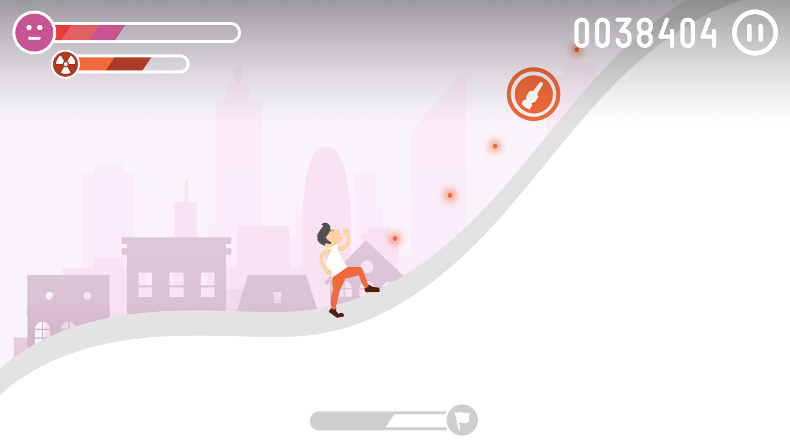

# Concepto: Pain Runner

Este concepto de juego unifica las tres experiencias del proyecto inicial (diagnósico, aplicación e impacto emocional) en una sola más compacta y simplificada.

# Mapa

Actua como pantalla de inicio y como principal metáfora de evolución, mostrando nuesrto progreso y el de nuestros principales competidores.

En la pare superior veremos las "vidas" que tenemos disponibles (que se recuperan con el transcurso del tiempo).

Este concepto de vidas con recuperación en el tiempo es el que nos permitirá potenciar el [efecto Zeigarnik](http://www.abc.es/tecnologia/moviles-aplicaciones/20130808/abci-candy-crush-saga-adictivo-201308071929.html) que será uno de los potenciadores claves de la experiencia (junto con el prestigio y la evolución).

También podremos acceder a los rankings (general, por perfil y geográficos) desde los que podremos seleccionar los usuarios "favoritos" que apareceran destacados en el mapa.

Ajustes nos permitir cambiar configuraciones del juego como el volumen y la cuenta asociada al mismo.

Esta cuenta será persistente entre dispositivos, pudiendo "autenticarme" en varios y llevarme el avance de uno a otro.

En el mapa también podremos observar nuestro Score y los distintos "casos clínicos" que tenemos disponibles.

# La mecánica del juego 

